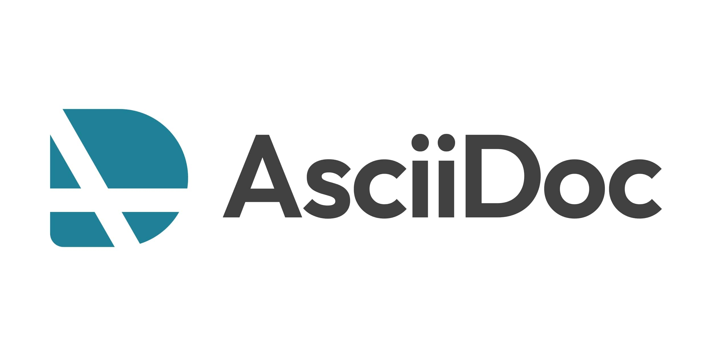

[#content-part]
= 正文部分

这是正文部分！

行内高亮： `java`。

== 代码高亮

[{java_src_attr}]
----
include::{sourcedir}/HelloWorld.java[]
----

== Tab 页

[tabs]
====
Tab A:: Contents of Tab A.

Tab B::
+
Contents of Tab B.

Tab C::
+
--
Contents of Tab C.

Contains more than one block.
--

Tab D::
+
--
[{java_src_attr}]
----
public class Test {
    public static void main(String[] args) {
        System.out.println("Hello");
    }
}
----
--
====

=== 嵌套 Tab 页

// https://github.com/asciidoctor/asciidoctor-tabs

[tabs]
======
Tab A::
+
Selecting Tab A reveals a tabset with Tab Y and Tab Z.
+
[tabs]
====
Tab Y:: Contents of Tab Y, nested inside Tab A.
Tab Z:: Contents of Tab Z, nested inside Tab A.
====

Tab B:: Just text.
======

== 图片

https://kroki.io/examples.html[Kroki! Examples^] -- Kroki 支持的各种图。

=== 引用外部图片： PlantUML

plantuml::{diagram_dir}/observer.puml[{diagram_attr}]

// 查看支持字体
//[plantuml, {diagram_attr}]
//....
//@startuml
//listfonts This is a test. 这是一个测试。這是一個測試。
//@enduml
//....

=== 引用外部序列图：SeqDiag

seqdiag::{diagram_dir}/seq.diag[{diagram_attr}]

=== 文内图片： PlantUML

[plantuml, {diagram_attr}]
....
@startuml
title "**装饰模式**"

abstract class Component {
  + {abstract} operation() :void
}
note right: Component 是定义一个对象接口，\n可以给这些对象动态地添加职责。

class ConcreteComponent {
  + operation() :void
}
note "ConcreteComponent 是定义了\n一个具体的对象，也可以给这个\n对象添加一些职责。" as ccn
ccn .. ConcreteComponent

abstract class Decorator {
  - component :Component
  + {abstract} operation() :void
}
note "Decorator，装饰抽象类，\n继承了 Component，从外类\n来扩展 Component 的功能，\n但对于 Component 来说，\n是无需知道 Decorator 的存在的。" as dn
Decorator .. dn

class ConcreteDecoratorA {
  + operation() :void
}

class ConcreteDecoratorB {
  + operation() :void
  - addBehavior() :void
}
note "ConcreteDecorator 就是具体的装饰对象，\n起到给 Component 添加职责的功能。" as cdn
'cdn .. ConcreteDecoratorA
'cdn .. ConcreteDecoratorB
ConcreteDecoratorA .. cdn
ConcreteDecoratorB .. cdn

Decorator "-component" o-- Component

Component <|-- ConcreteComponent
Component <|-- Decorator
Decorator <|-- ConcreteDecoratorA
Decorator <|-- ConcreteDecoratorB

footer D瓜哥 · https://www.diguage.com · 出品
@enduml
....

=== GraphViz

[graphviz, {diagram_attr}]
....
digraph foo {
  node [style=rounded]
  node1 [shape=box]
  node2 [fillcolor=yellow, style="rounded,filled", shape=diamond]
  node3 [shape=record, label="{ a | b | c }"]

  node1 -> node2 -> node3
}
....

=== mermaid

https://mermaid.js.org/intro/[Mermaid^] -- 图片类型挺丰富的

==== 饼图

[mermaid, {diagram_attr}]
....
pie title Pets adopted by volunteers
    "Dogs" : 386
    "Cats" : 85
    "Rats" : 15
....

==== 雷达图

[mermaid, {diagram_attr}]
....
---
config:
  radar:
    axisScaleFactor: 0.25
    curveTension: 0.1
  theme: base
  themeVariables:
    cScale0: "#FF0000"
    cScale1: "#00FF00"
    cScale2: "#0000FF"
    radar:
      curveOpacity: 0
---
radar-beta
  axis A, B, C, D, E
  curve c1{1,2,3,4,5}
  curve c2{5,4,3,2,1}
  curve c3{3,3,3,3,3}
....

==== 甘特图

[mermaid, {diagram_attr}]
....
gantt
    dateFormat  YYYY-MM-DD
    title       Adding GANTT diagram functionality to mermaid
    excludes    weekends
    %% (`excludes` accepts specific dates in YYYY-MM-DD format, days of the week ("sunday") or "weekends", but not the word "weekdays".)

    section A section
    Completed task            :done,    des1, 2014-01-06,2014-01-08
    Active task               :active,  des2, 2014-01-09, 3d
    Future task               :         des3, after des2, 5d
    Future task2              :         des4, after des3, 5d

    section Critical tasks
    Completed task in the critical line :crit, done, 2014-01-06,24h
    Implement parser and jison          :crit, done, after des1, 2d
    Create tests for parser             :crit, active, 3d
    Future task in critical line        :crit, 5d
    Create tests for renderer           :2d
    Add to mermaid                      :until isadded
    Functionality added                 :milestone, isadded, 2014-01-25, 0d

    section Documentation
    Describe gantt syntax               :active, a1, after des1, 3d
    Add gantt diagram to demo page      :after a1  , 20h
    Add another diagram to demo page    :doc1, after a1  , 48h

    section Last section
    Describe gantt syntax               :after doc1, 3d
    Add gantt diagram to demo page      :20h
    Add another diagram to demo page    :48h
....

=== blockdiag

[blockdiag, {diagram_attr}]
....
blockdiag {
  Kroki -> generates -> "Block diagrams";
  Kroki -> is -> "very easy!";

  Kroki [color = "greenyellow"];
  "Block diagrams" [color = "pink"];
  "very easy!" [color = "orange"];
}
....

=== ByteField

[bytefield, {diagram_attr}]
....
(defattrs :bg-green {:fill "#a0ffa0"})
(defattrs :bg-yellow {:fill "#ffffa0"})
(defattrs :bg-pink {:fill "#ffb0a0"})
(defattrs :bg-cyan {:fill "#a0fafa"})
(defattrs :bg-purple {:fill "#e4b5f7"})

(defn draw-group-label-header
  [span label]
  (draw-box (text label [:math {:font-size 12}]) {:span span :borders #{} :height 14}))

(defn draw-remotedb-header
  [kind args]
  (draw-column-headers)
  (draw-group-label-header 5 "start")
  (draw-group-label-header 5 "TxID")
  (draw-group-label-header 3 "type")
  (draw-group-label-header 2 "args")
  (draw-group-label-header 1 "tags")
  (next-row 18)

  (draw-box 0x11 :bg-green)
  (draw-box 0x872349ae [{:span 4} :bg-green])
  (draw-box 0x11 :bg-yellow)
  (draw-box (text "TxID" :math) [{:span 4} :bg-yellow])
  (draw-box 0x10 :bg-pink)
  (draw-box (hex-text kind 4 :bold) [{:span 2} :bg-pink])
  (draw-box 0x0f :bg-cyan)
  (draw-box (hex-text args 2 :bold) :bg-cyan)
  (draw-box 0x14 :bg-purple)

  (draw-box (text "0000000c" :hex [[:plain {:font-weight "light" :font-size 16}] " (12)"]) [{:span 4} :bg-purple])
  (draw-box (hex-text 6 2 :bold) [:box-first :bg-purple])
  (doseq [val [6 6 3 6 6 6 6 3]]
    (draw-box (hex-text val 2 :bold) [:box-related :bg-purple]))
  (doseq [val [0 0]]
    (draw-box val [:box-related :bg-purple]))
  (draw-box 0 [:box-last :bg-purple]))

(draw-remotedb-header 0x4702 9)

(draw-box 0x11)
(draw-box 0x2104 {:span 4})
(draw-box 0x11)
(draw-box 0 {:span 4})
(draw-box 0x11)
(draw-box (text "length" [:math] [:sub 1]) {:span 4})
(draw-box 0x14)

(draw-box (text "length" [:math] [:sub 1]) {:span 4})
(draw-gap "Cue and loop point bytes")

(draw-box nil :box-below)
(draw-box 0x11)
(draw-box 0x36 {:span 4})
(draw-box 0x11)
(draw-box (text "num" [:math] [:sub "hot"]) {:span 4})
(draw-box 0x11)
(draw-box (text "num" [:math] [:sub "cue"]) {:span 4})

(draw-box 0x11)
(draw-box (text "length" [:math] [:sub 2]) {:span 4})
(draw-box 0x14)
(draw-box (text "length" [:math] [:sub 2]) {:span 4})
(draw-gap "Unknown bytes" {:min-label-columns 6})
(draw-bottom)
....

=== ActDiag

[actdiag, {diagram_attr}]
....
actdiag {
  write -> convert -> image

  lane user {
    label = "User"
    write [label = "Writing text"];
    image [label = "Get diagram image"];
  }
  lane Kroki {
    convert [label = "Convert text to image"];
  }
}
....

=== NwDiag

[nwdiag, {diagram_attr}]
....
nwdiag {
  network dmz {
    address = "210.x.x.x/24"

    web01 [address = "210.x.x.1"];
    web02 [address = "210.x.x.2"];
  }
  network internal {
    address = "172.x.x.x/24";

    web01 [address = "172.x.x.1"];
    web02 [address = "172.x.x.2"];
    db01;
    db02;
  }
}
....

=== PacketDiag

[packetdiag, {diagram_attr}]
....
packetdiag {
  colwidth = 32;
  node_height = 72;

  0-15: Source Port;
  16-31: Destination Port;
  32-63: Sequence Number;
  64-95: Acknowledgment Number;
  96-99: Data Offset;
  100-103: Reserved;
  104: CWR [rotate = 270];
  105: ECE [rotate = 270];
  106: URG [rotate = 270];
  107: ACK [rotate = 270];
  108: PSH [rotate = 270];
  109: RST [rotate = 270];
  110: SYN [rotate = 270];
  111: FIN [rotate = 270];
  112-127: Window;
  128-143: Checksum;
  144-159: Urgent Pointer;
  160-191: (Options and Padding);
  192-223: data [colheight = 3];
}
....

=== C4 PlantUML

[c4plantuml, {diagram_attr}]
....
!include <C4/C4_Context>

title System Context diagram for Internet Banking System

Person(customer, "Banking Customer", "A customer of the bank, with personal bank accounts.")
System(banking_system, "Internet Banking System", "Allows customers to check their accounts.")

System_Ext(mail_system, "E-mail system", "The internal Microsoft Exchange e-mail system.")
System_Ext(mainframe, "Mainframe Banking System", "Stores all of the core banking information.")

Rel(customer, banking_system, "Uses")
Rel_Back(customer, mail_system, "Sends e-mails to")
Rel_Neighbor(banking_system, mail_system, "Sends e-mails", "SMTP")
Rel(banking_system, mainframe, "Uses")
....

=== Ditaa

[ditaa, {diagram_attr}]
....
      +--------+
      |        |
      |  User  |
      |        |
      +--------+
          ^
  request |
          v
  +-------------+
  |             |
  |    Kroki    |
  |             |---+
  +-------------+   |
       ^  ^         | inflate
       |  |         |
       v  +---------+
  +-------------+
  |             |
  |    Ditaa    |
  |             |----+
  +-------------+    |
             ^       | process
             |       |
             +-------+
....

=== TikZ

[tikz, {diagram_attr}]
....
\documentclass{article}
\usepackage{tikz}
\usepackage{tikz-3dplot}
\usetikzlibrary{math}
\usepackage[active,tightpage]{preview}
\PreviewEnvironment{tikzpicture}
\setlength\PreviewBorder{0.125pt}
%
% File name: directional-angles.tex
% Description:
% The directional angles of a vector are geometrically represented.
%
% Date of creation: July, 25th, 2021.
% Date of last modification: October, 9th, 2022.
% Author: Efra�n Soto Apolinar.
% https://www.aprendematematicas.org.mx/author/efrain-soto-apolinar/instructing-courses/
% Source: page 11 of the
% Glosario Ilustrado de Matematicas Escolares.
% https://tinyurl.com/5udm2ufy
%
% Terms of use:
% According to TikZ.net
% https://creativecommons.org/licenses/by-nc-sa/4.0/
% Your commitment to the terms of use is greatly appreciated.
%
\begin{document}
  \tdplotsetmaincoords{80}{120}
  %
  \begin{tikzpicture}[tdplot_main_coords,scale=0.75]
    % Indicate the components of the vector in rectangular coordinates
    \pgfmathsetmacro{\ux}{4}
    \pgfmathsetmacro{\uy}{4}
    \pgfmathsetmacro{\uz}{3}
    % Length of each axis
    \pgfmathsetmacro{\ejex}{\ux+0.5}
    \pgfmathsetmacro{\ejey}{\uy+0.5}
    \pgfmathsetmacro{\ejez}{\uz+0.5}
    \pgfmathsetmacro{\umag}{sqrt(\ux*\ux+\uy*\uy+\uz*\uz)} % Magnitude of vector $\vec{u}$
    % Compute the angle $\theta$
    \pgfmathsetmacro{\angthetax}{pi*atan(\uy/\ux)/180}
    \pgfmathsetmacro{\angthetay}{pi*atan(\ux/\uz)/180}
    \pgfmathsetmacro{\angthetaz}{pi*atan(\uz/\uy)/180}
    % Compute the angle $\phi$
    \pgfmathsetmacro{\angphix}{pi*acos(\ux/\umag)/180}
    \pgfmathsetmacro{\angphiy}{pi*acos(\uy/\umag)/180}
    \pgfmathsetmacro{\angphiz}{pi*acos(\uz/\umag)/180}
    % Compute rho sin(phi) to simplify computations
    \pgfmathsetmacro{\costz}{cos(\angthetax r)}
    \pgfmathsetmacro{\sintz}{sin(\angthetax r)}
    \pgfmathsetmacro{\costy}{cos(\angthetay r)}
    \pgfmathsetmacro{\sinty}{sin(\angthetay r)}
    \pgfmathsetmacro{\costx}{cos(\angthetaz r)}
    \pgfmathsetmacro{\sintx}{sin(\angthetaz r)}
    % Coordinate axis
    \draw[thick,->] (0,0,0) -- (\ejex,0,0) node[below left] {$x$};
    \draw[thick,->] (0,0,0) -- (0,\ejey,0) node[right] {$y$};
    \draw[thick,->] (0,0,0) -- (0,0,\ejez) node[above] {$z$};
    % Projections of the components in the axis
    \draw[gray,very thin,opacity=0.5] (0,0,0) -- (\ux,0,0) -- (\ux,\uy,0) -- (0,\uy,0) -- (0,0,0);	% face on the plane z = 0
    \draw[gray,very thin,opacity=0.5] (0,0,\uz) -- (\ux,0,\uz) -- (\ux,\uy,\uz) -- (0,\uy,\uz) -- (0,0,\uz);	% face on the plane z = \uz
    \draw[gray,very thin,opacity=0.5] (0,0,0) -- (0,0,\uz) -- (\ux,0,\uz) -- (\ux,0,0) -- (0,0,0);	% face on the plane y = 0
    \draw[gray,very thin,opacity=0.5] (0,\uy,0) -- (0,\uy,\uz) -- (\ux,\uy,\uz) -- (\ux,\uy,0) -- (0,\uy,0);	% face on the plane y = \uy
    \draw[gray,very thin,opacity=0.5] (0,0,0) -- (0,\uy,0) -- (0,\uy,\uz) -- (0,0,\uz) -- (0,0,0); % face on the plane x = 0
    \draw[gray,very thin,opacity=0.5] (\ux,0,0) -- (\ux,\uy,0) -- (\ux,\uy,\uz) -- (\ux,0,\uz) -- (\ux,0,0); % face on the plane x = \ux
    % Arc indicating the angle $\alpha$
    % (angle formed by the vector $\vec{v}$ and the $x$ axis)
    \draw[red,thick] plot[domain=0:\angphix,smooth,variable=\t] ({cos(\t r)},{sin(\t r)*\costx},{sin(\t r)*\sintx});
    % Arc indicating the angle $\beta$
    % (angle formed by the vector $\vec{v}$ and the $y$ axis)
    \draw[red,thick] plot[domain=0:\angphiy,smooth,variable=\t] ({sin(\t r)*\sinty},{cos(\t r)},{sin(\t r)*\costy});
    % Arc indicating the angle $\gamma$
    % (angle formed by the vector $\vec{v}$ and the $z$ axis)
    \draw[red,thick] plot[domain=0:\angphiz,smooth,variable=\t] ({sin(\t r)*\costz},{sin(\t r)*\sintz},{cos(\t r)});
    % Vector $\vec{u}$
    \draw[blue,thick,->] (0,0,0) -- (\ux,\uy,\uz) node [below right] {$\vec{u}$};
    % Nodes indicating the direction angles
    \pgfmathsetmacro{\xa}{1.85*cos(0.5*\angphix r)}
    \pgfmathsetmacro{\ya}{1.85*sin(0.5*\angphix r)*\costx}
    \pgfmathsetmacro{\za}{1.85*sin(0.5*\angphiz r)*\sintx}
    \node[red] at (\xa,\ya,\za) {\footnotesize$\alpha$};
    %
    \pgfmathsetmacro{\xb}{1.5*sin(0.5*\angphiy r)*\sinty}
    \pgfmathsetmacro{\yb}{1.5*cos(0.5*\angphiy r)}
    \pgfmathsetmacro{\zb}{1.5*sin(0.5*\angphiy r)*\costy}
    \node[red] at (\xb,\yb,\zb) {\footnotesize$\beta$};
    %
    \pgfmathsetmacro{\xc}{1.5*sin(0.5*\angphiz r)*\costz}
    \pgfmathsetmacro{\yc}{1.5*sin(0.5*\angphiz r)*\sintz}
    \pgfmathsetmacro{\zc}{1.5*cos(0.5*\angphiz r)}
    \node[red] at (\xc,\yc,\zc) {\footnotesize$\gamma$};
    %
  \end{tikzpicture}
  %
\end{document}
....

=== Vega

[vega, {diagram_attr}]
....
{
  "$schema": "https://vega.github.io/schema/vega/v5.json",
  "width": 400,
  "height": 200,
  "padding": 5,

  "data": [
    {
      "name": "table",
      "values": [
        {"category": "A", "amount": 28},
        {"category": "B", "amount": 55},
        {"category": "C", "amount": 43},
        {"category": "D", "amount": 91},
        {"category": "E", "amount": 81},
        {"category": "F", "amount": 53},
        {"category": "G", "amount": 19},
        {"category": "H", "amount": 87}
      ]
    }
  ],

  "signals": [
    {
      "name": "tooltip",
      "value": {},
      "on": [
        {"events": "rect:mouseover", "update": "datum"},
        {"events": "rect:mouseout",  "update": "{}"}
      ]
    }
  ],

  "scales": [
    {
      "name": "xscale",
      "type": "band",
      "domain": {"data": "table", "field": "category"},
      "range": "width",
      "padding": 0.05,
      "round": true
    },
    {
      "name": "yscale",
      "domain": {"data": "table", "field": "amount"},
      "nice": true,
      "range": "height"
    }
  ],

  "axes": [
    { "orient": "bottom", "scale": "xscale" },
    { "orient": "left", "scale": "yscale" }
  ],

  "marks": [
    {
      "type": "rect",
      "from": {"data":"table"},
      "encode": {
        "enter": {
          "x": {"scale": "xscale", "field": "category"},
          "width": {"scale": "xscale", "band": 1},
          "y": {"scale": "yscale", "field": "amount"},
          "y2": {"scale": "yscale", "value": 0}
        },
        "update": {
          "fill": {"value": "steelblue"}
        },
        "hover": {
          "fill": {"value": "red"}
        }
      }
    },
    {
      "type": "text",
      "encode": {
        "enter": {
          "align": {"value": "center"},
          "baseline": {"value": "bottom"},
          "fill": {"value": "#333"}
        },
        "update": {
          "x": {"scale": "xscale", "signal": "tooltip.category", "band": 0.5},
          "y": {"scale": "yscale", "signal": "tooltip.amount", "offset": -2},
          "text": {"signal": "tooltip.amount"},
          "fillOpacity": [
            {"test": "datum === tooltip", "value": 0},
            {"value": 1}
          ]
        }
      }
    }
  ]
}

....

=== VegaLite

vegalite::{diagram_dir}/chart.vlite[{diagram_attr}]

=== WaveDrom

[wavedrom, {diagram_attr}]
....
{ signal: [
  { name: "clk",         wave: "p.....|..." },
  { name: "Data",        wave: "x.345x|=.x", data: ["head", "body", "tail", "data"] },
  { name: "Request",     wave: "0.1..0|1.0" },
  {},
  { name: "Acknowledge", wave: "1.....|01." }
]}
....

